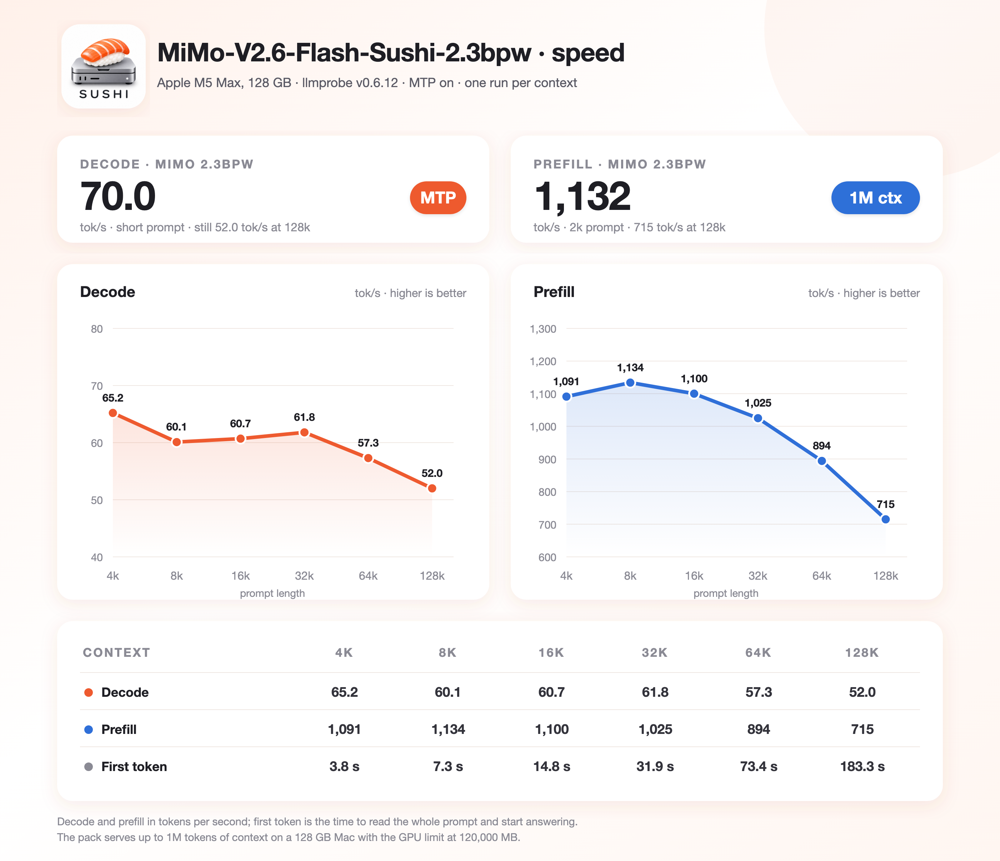

<p align="center"></p>

# SUSHI

A detached fork of [ddalcu's mlx-serve](https://github.com/ddalcu/mlx-serve) masterpiece, focused only on serving selected models on Apple Silicon with custom sushi quants. Sushi mixes EXL3 and affine formats tailored for M5 Pro/Max-class chips. M1-M4 chips still run well. While Sushi works as a stand alone engine, it aims to stay within mlx-serve as a guest engine.

## Model support list

* [Qwen3.8-Flash-Next-Sushi-2bpw](https://huggingface.co/beamster/Qwen3.8-Flash-Next-Sushi-2bpw) (requires 48 GB+)
* [Qwen3.8-Flash-Next-Sushi-2.6bpw](https://huggingface.co/beamster/Qwen3.8-Flash-Next-Sushi-2.6bpw) (requires 64 GB+)
* [Qwen3.8-Flash-Next-Sushi-3bpw](https://huggingface.co/beamster/Qwen3.8-Flash-Next-Sushi-3bpw) (requires 64 GB+)
* [Qwen3.8-Flash-Next-Sushi-4bpw](https://huggingface.co/beamster/Qwen3.8-Flash-Next-Sushi-4bpw) (requires 96 GB+)
* [MiMo-V2.6-Flash-Sushi-2.3bpw](https://huggingface.co/beamster/MiMo-V2.6-Flash-Sushi-2.3bpw) (requires 128 GB, text and image input)

## Install

With Homebrew (adds the `beamivalice/tap` tap and installs sushi in one command):
```bash
brew install beamivalice/tap/sushi
```

Update with `brew upgrade sushi`

With Tarball.
```bash
curl -L https://github.com/beamivalice/sushi/releases/latest/download/sushi-bin-macos-arm64.tar.gz | tar xz
./sushi-macos-arm64/sushi --version
```

Update with `sushi update` (or the button in the chat page).

Build from source (needs Xcode 26.2+ with its Metal toolchain; `brew bundle` installs cmake and webp):
```bash
git clone --recurse-submodules https://github.com/beamivalice/sushi && cd sushi
brew bundle
./scripts/fetch-zig.sh && ./scripts/build-mlx.sh
.zig-toolchain/zig build -Doptimize=ReleaseFast
mkdir -p ~/.local/bin && ln -s "$PWD/zig-out/bin/sushi" ~/.local/bin/sushi   # or any directory on your PATH
```

The server listens on `127.0.0.1:12345`, the model's own MTP draft head and the 8-bit KV cache are on by default.

## Memory

GPU memory in GiB to serve one prompt that fills the whole context (8-bit KV, MTP on, `--mtp-head-kv-quant`,
`--prefix-cache-mem 1GB`). The n-gram table stays on the SSD and is not counted.

| context | Sushi-2bpw | Sushi-2.6bpw | Sushi-4bpw | MiMo-2.3bpw |
|---|---:|---:|---:|---:|
| weights only | 35.0 | 44.0 | 63.7 | 83.6 |
| 128k | 41.7 | 50.7 | 70.4 | 88.3 |
| 256k | 44.6 | 53.6 | 73.3 | 90.2 |
| 512k | 49.7 | 58.6 | 78.4 | 93.9 |
| 1M | 59.8 | 68.8 | 88.5 | 101.4 |

A context fits when its number is below the GPU limit you set with `sudo sysctl iogpu.wired_limit_mb`. Max context is
the largest one that fits, at 8-bit / 4-bit KV, with 256 MiB spare and capped at 1M:

| Mac | GPU limit | Sushi-2bpw | Sushi-2.6bpw | Sushi-4bpw | MiMo-2.3bpw |
|---|---|---|---|---|---|
| 48 GB | 43,000 MB (42.0 GiB) | 128k / 192k | — | — | — |
| 64 GB | 59,000 MB (57.6 GiB) | 896k / 1M | 440k / 744k | — | — |
| 96 GB | 88,000 MB (85.9 GiB) | 1M / 1M | 1M / 1M | 880k / 1M | — |
| 128 GB | 120,000 MB (117.2 GiB) | 1M / 1M | 1M / 1M | 1M / 1M | 1M / 1M |

A Mac with less memory than a Sushi pack can still serve it: `--ssd-budget-gb N` keeps N GiB resident and streams
the routed experts from the SSD, with the same replies as a resident load, at a speed set by the SSD.

## Benchmarks

Reported speed using llmprobe `--bench-only`:

| Class | Typical RAM | Pack | Prefill tok/s | Gen tok/s |
|---|---|---|---:|---:|
| M1 Max | 64 GB | 3bpw | ~350 | ~32 |
| M2 Max | 64 GB | 3bpw | ~400 | ~38-40 |
| M3 Ultra 60c | 256 GB | 4bpw | ~420 | ~60 |
| M4 Max | 64 GB | 3bpw | ~690 | ~60-65 |
| M5 Pro | 64 GB | 2.6bpw | ~900 | ~50-55 |
| M5 Max | 128 GB | 3bpw | ~1,900 | ~95 |
| M5 Max | 128 GB | 4bpw | ~1,750 | ~90 |
| M5 Max | 128 GB | MiMo 2.3bpw | ~1,130 | ~70 |

## Recommended launch

**48 GB Mac, Sushi-2bpw**

Set the GPU memory limit first (it resets at reboot):
```bash
sudo sysctl iogpu.wired_limit_mb=43000
```

```bash
hf download beamster/Qwen3.8-Flash-Next-Sushi-2bpw --local-dir ~/.sushi/models/Qwen3.8-Flash-Next-Sushi-2bpw

# images, 8-bit KV, 128k context
./sushi-macos-arm64/sushi serve --model ~/.sushi/models/Qwen3.8-Flash-Next-Sushi-2bpw \
  --mtp --kv-quant 8 --mtp-head-kv-quant --ctx-size 131072 \
  --max-tokens 32000 --prefix-cache-disk 20GB --prefix-cache-entries 1 --prefix-cache-mem 1GB --temp 1
```

**64 GB Mac, Sushi-2.6bpw**

Set the GPU memory limit first (it resets at reboot). 59,000 MB is the ceiling for this box: above it macOS runs out
of memory before the model does, and the kernel panics rather than the server refusing.
```bash
sudo sysctl iogpu.wired_limit_mb=59000
```

Then pick one of the two. They differ only in KV width; the context is set explicitly because auto-context reads free
memory, so its answer is not the same on two 64 GB machines.

```bash
hf download beamster/Qwen3.8-Flash-Next-Sushi-2.6bpw --local-dir ~/.sushi/models/Qwen3.8-Flash-Next-Sushi-2.6bpw

# 1. images, 8-bit KV — the default quality
./sushi-macos-arm64/sushi serve --model ~/.sushi/models/Qwen3.8-Flash-Next-Sushi-2.6bpw \
  --mtp --kv-quant 8 --mtp-head-kv-quant --ctx-size 250000 \
  --max-tokens 32000 --prefix-cache-disk 20GB --prefix-cache-entries 1 --prefix-cache-mem 1GB --temp 1

# 2. images, 4-bit KV — 1.8 times the context, at 8% KLD and 0.2 points of next-token agreement
./sushi-macos-arm64/sushi serve --model ~/.sushi/models/Qwen3.8-Flash-Next-Sushi-2.6bpw \
  --mtp --kv-quant 4 --mtp-head-kv-quant --ctx-size 450000 \
  --max-tokens 64000 --prefix-cache-disk 20GB --prefix-cache-entries 1 --prefix-cache-mem 1GB --temp 1
```

At 4-bit KV the quality cost: mean KLD 0.1355 at 8-bit KV to 0.1458, and next-token agreement 89.08% to 88.84%.

**96 GB+ Mac, Sushi-4bpw**

```bash
hf download beamster/Qwen3.8-Flash-Next-Sushi-4bpw --local-dir ~/.sushi/models/Qwen3.8-Flash-Next-Sushi-4bpw
./sushi-macos-arm64/sushi serve --model ~/.sushi/models/Qwen3.8-Flash-Next-Sushi-4bpw \
  --mtp --kv-quant 8 --mtp-head-kv-quant --ctx-size 500000 \
  --prefill-chunk 2048 --max-tokens 64000 --prefix-cache-disk 20GB \
  --prefix-cache-entries 1 --prefix-cache-mem 2GB --temp 1
```

Set the GPU memory limit before serving (it resets at reboot):
```bash
sudo sysctl iogpu.wired_limit_mb=88000    # 96 GB Mac
sudo sysctl iogpu.wired_limit_mb=120000   # 128 GB Mac
```

**128 GB Mac, MiMo-V2.6-Flash-Sushi-2.3bpw**

```bash
sudo sysctl iogpu.wired_limit_mb=120000
hf download beamster/MiMo-V2.6-Flash-Sushi-2.3bpw --local-dir ~/.sushi/models/MiMo-V2.6-Flash-Sushi-2.3bpw

# images, 8-bit KV, MTP, the full 1M context
./sushi-macos-arm64/sushi serve --model ~/.sushi/models/MiMo-V2.6-Flash-Sushi-2.3bpw --ctx-size 1048576
```

MTP and the 8-bit KV cache are on by default for MiMo, and thinking is on by default, as in Xiaomi's chat template.

- `--mtp-head-kv-quant` stores the MTP head's own KV at 8 bits too.
- `--preserve-thinking off` keeps only the latest turn's thinking in the prompt. Agents running long sessions may prefer
  it for the shorter context; each new instruction then re-processes the prompt from the first dropped thought.
- `--prefill-chunk 2048` is the widest prompt step per forward; a wider one costs memory without prefilling faster,
  and a request that does not fit steps down to a narrower chunk.
- `--prefix-cache-mem 1GB` keeps seen prompt prefixes hot in RAM, faster than the SSD.
- `--prefix-cache-disk 20GB` keeps seen prompt prefixes on the SSD, so a repeated prompt skips its prefill.
- `--prefix-cache-entries 1` keeps one conversation's prefix; raise it to 4-8 when several agents share the server.

## Coding agents

With the server running, `sushi launch <agent>` starts claude, pi, omp, opencode, codex, hermes or aider against it:

```bash
sushi launch omp
```

pi, omp, codex and hermes run from their own home under `~/.sushi/<agent>/`, so your usual config is untouched and
the session does not see your other providers, settings or history; claude, opencode and aider reach the server
through environment variables. `--print` writes the config and prints the launch script instead of running it.

## Quality

<p align="center"></p>

KLD against the bf16 model: 16 prompts x 512 tokens scored to the first EOS, kv8, every pack scored by sushi (Sushi-2bpw
with a bf16 KV cache). Each pack is plotted with the n-gram table it ships: bf16 in Sushi-4bpw, 4-bit in Sushi-2bpw,
Sushi-2.6bpw and Sushi-3bpw; either table works with any pack. Numbers: [docs/quality-kld.md](docs/quality-kld.md).

MiMo-V2.6-Flash-Sushi-2.3bpw scores KLD 0.0860 (top-1 agreement 91.95%) against the original MOPD checkpoint, same
method.

## Speed

Sushi-3bpw on an M5 Max 128 GB, sushi v1.0.0 release candidate (build 725b76ca): `--ctx-size 1048576 --kv-quant 8 --mtp`, llmprobe `--bench-only`, quiet box.

<p align="center"></p>

Smaller Macs have less memory bandwidth, so expect lower numbers. Chips before M5 also lack the neural accelerators:
a user reported about 400 tok/s prefill at 2-16k tokens and 38.6 tok/s decode on an M2 Max 64 GB running v1.0.4
([numbers](docs/perf-baselines.md#m2max-64gb)).

MiMo-V2.6-Flash-Sushi-2.3bpw on the same Mac:

<p align="center"></p>

## License

MIT, for sushi and the mlx-serve code it forks ([LICENSE](LICENSE)); ported kernels and vendored code are listed in
[NOTICE](NOTICE). The Qwen packs follow the Qwen Community License and the MiMo pack Xiaomi's MIT license, stated on
each Hugging Face page.
